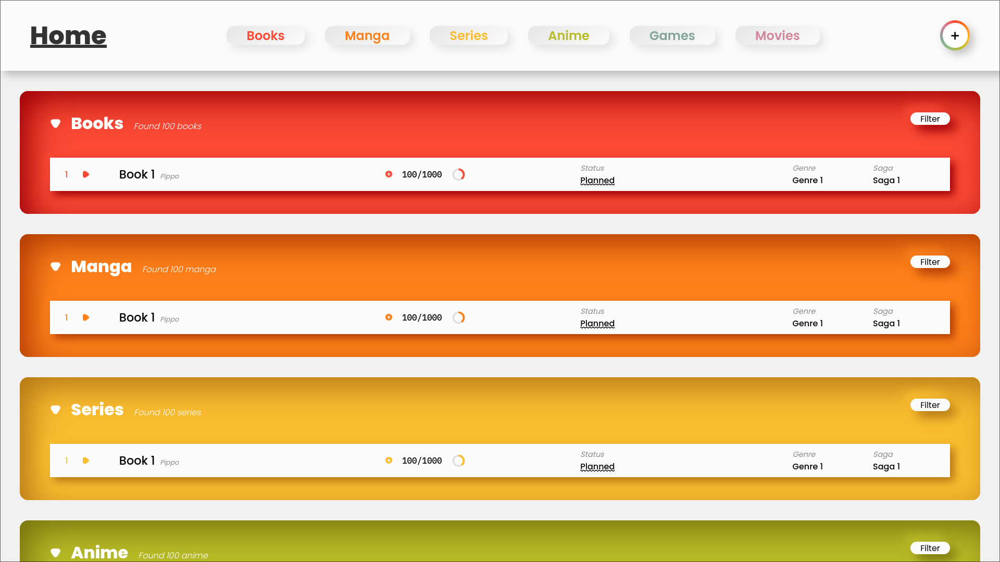

# Media Library Project <!-- omit in toc -->

## Description <!-- omit in toc -->

This project is a media library that allows you to store and organize your books, movies, series, and other media. It is a full-stack project that uses a React frontend and a Node.js backend.

It's purpose is to help you keep track of your media and to provide a way to store notes and other information about them.

As I grew tired of using multiple apps to keep track of my media, I decided to create this project to have everything in one place; also I wanted to learn more about full-stack development.

## Images <!-- omit in toc -->



## Table of Contents <!-- omit in toc -->

- [Features](#features)
- [How to run](#how-to-run)
- [TODO -WIP](#todo--wip)
- [Essentials](#essentials)
- [Backend](#backend)
- [Frontend](#frontend)

## Features

> [ ] = not implemented, [x] = implemented

- [x] Add books, movies, series, and other media
- [ ] Sort by genre, author, director, etc.
- [ ] Keep track of what you are currently reading, watching, etc.
- [ ] Keep track of progress
- [ ] Add notes and other information
- [ ] Add files and other media to the library
- [ ] Search, retrieve and download media from the website
- [ ] Read and watch media directly from the website

## How to run

> **Note**: This project is still in development and is not yet ready for production. This guide is for development purposes only.

1. Clone the repository

   1. In the backend folder, create a `.env` file with the following content:

      ```env
      PORT= <port>
      MONGO_URI= <mongo_uri>
      ```

      Replace `<port>` with the port you want the server to run on and `<mongo_uri>` with the URI of your MongoDB database.

2. Run `npm install` in the **backend** and **frontend** folders
3. Run `npm run dev` in the **backend** folder
4. Run `npm start` in the **frontend** folder
5. Open your browser and go to `localhost:3000`

## TODO -WIP

> [Tutorial](https://www.youtube.com/watch?v=O8IipcpTmYU&list=PL4cUxeGkcC9iJ_KkrkBZWZRHVwnzLIoUE&index=5) timestamp 6:44

## Essentials

- add license
- Aggiungi documentazione inline
- Aggiungi descrizione progetto
- Aggiungi readme
- Documenta backend-frontend
- Rename all "FILM" to "MOVIE"
- Imposta delle variabili di default per lo status (Active, On hold, ...) e per i generi (Adventure, Action, ...)

## Backend

- Snellisci e riformatta il codice
- Finisci i controller
- Finish setting up database functions
  - Add paths to database models for storage
  - Add routes
- Add storage for files

## Frontend

- Add quick update to preview page (quick update pages of book)
- Add file preview and download
- mentre sei sul sito usa '/' per cercare e implementa anche tasti per scorrere le ricerche/azioni veloci/scorrere pagine (books,films,...)
- la home ha la lista delle serie/libri/... che stai leggendo/guardando
- Make the notes rendered in markdown
- Cambia il colorore dello status negli elementi della lista in base allo status
- finish padding on element list
- make fully responsive
- fix CSS inheritance because its shit
  - Same with css in general, theres code duplication everywhere
- Premi / per cercare localmente shift+/ per globale
- 1 2 3 4 per cambiare tab
- tasti per sortare/filtrare
- Finisci le varie tipologie di visualizzazione dei listElement
- Implementa Le immagini
- Aggiungi fuzzy-find per le ricerche
- Tieni a memoria e display dei filtri attivi
- Sistema il filter popup pk è brutto e il modo per passargli i filtri fa schifo
- Change status to completed if all pages are read
- Fix the error where in fils you can exceed the maxduration (+60 every increment)
- Add a manu for fast increase in pages read
- Simplify / removed duplicate code from listelements and the handleIncrement function